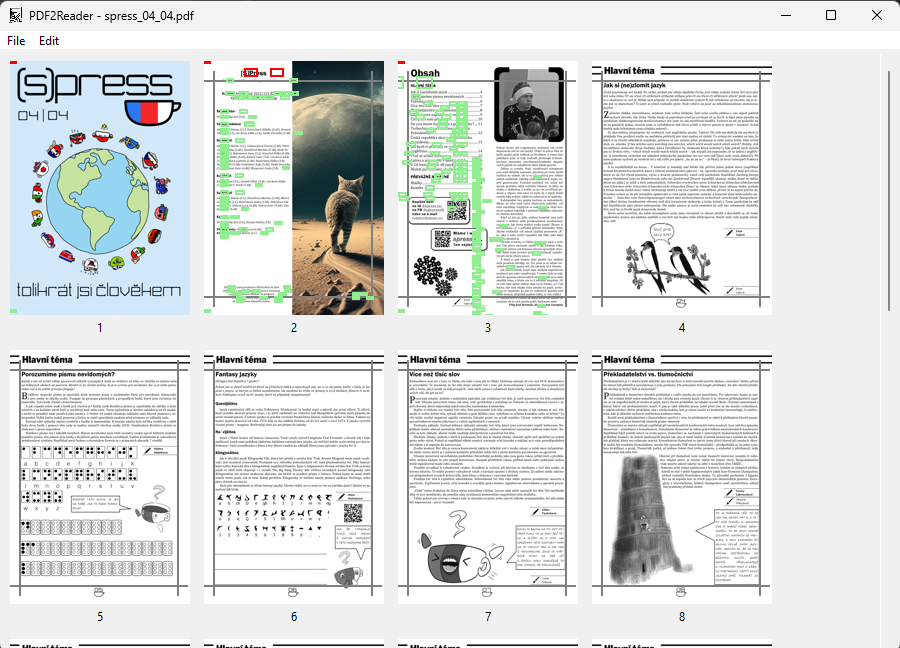

# pdf2reader

Small app to convert PDFs to be more readable on ebook readers.

### Features

- Batch page cropping
  - Page cropping for single pages
  - Batch cropping multiple pages at once
- Images optimization
  - Compression
  - Lowering resolution
  - Complete images removal 
- Batch removal of repeating text
  - Identical text object detection over multiple pages
  - Option to select which text segments to keep / remove both on single page and in batch over multiple pages

### Usage

0. Run `pdf2reader`
1. Open Pdf from the File menu
2. Edit Pdf to your liking
3. Save Pdf from the File menu

### Installation

- Run `pip install git+https://github.com/gamecraftCZ/pdf2reader.git`
